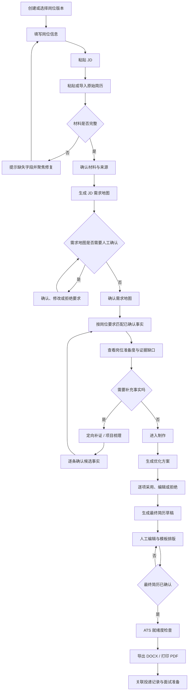
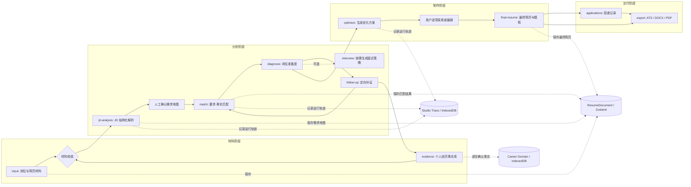
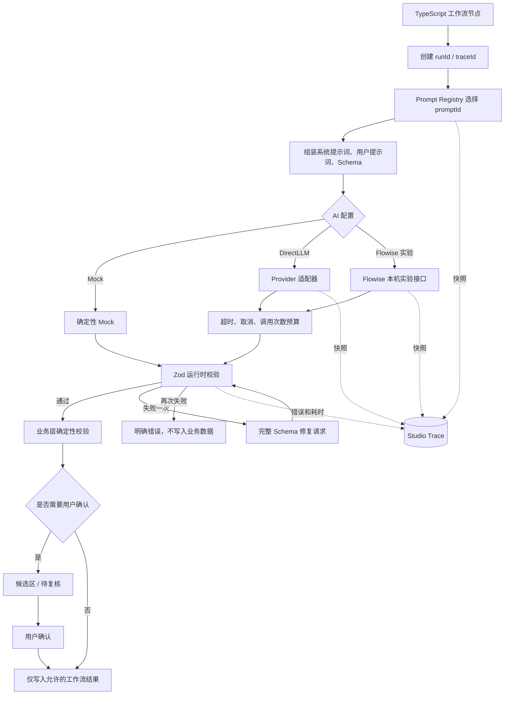
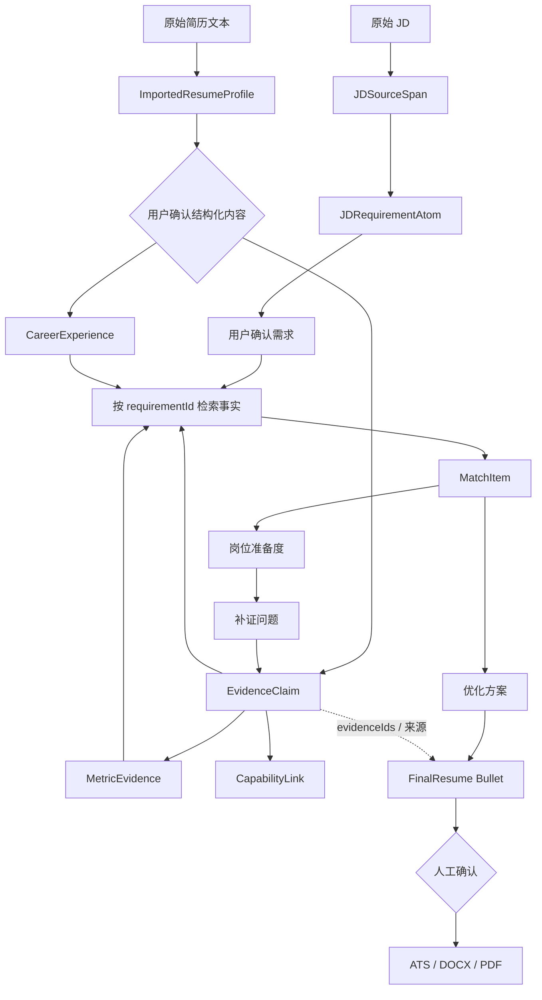
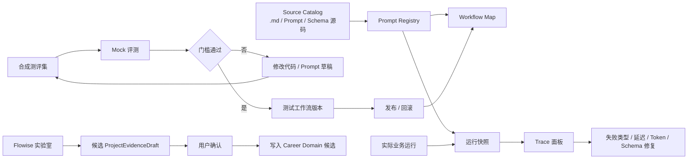
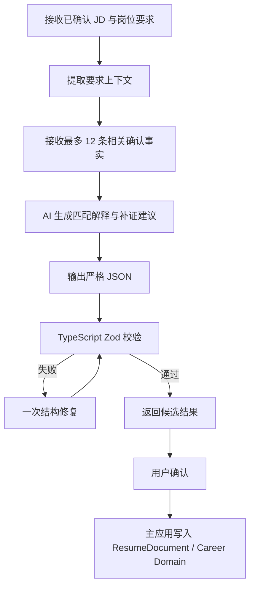

# 简历专家工作流图谱

本文档按当前 V1.9.7 代码整理，分开描述正式业务流程、AI 执行流程、数据流和开发者工作台。外部工作流平台只应承载可替换的 AI 节点；状态、校验、持久化和门禁仍由 TypeScript 主应用负责。

## 1. 用户使用流程

这是适合向产品经理、用户或面试官展示的主流程图。



关键原则：

- “识别到”不等于“可信”。需求、事实和最终简历都有确认门禁。
- JD、材料、已确认事实或优化风格变化后，依赖结果会过期，不能继续导出旧结果。
- 面试准备和面试复盘是辅助流程，不应阻塞简历交付。

## 2. TypeScript 正式业务工作流

这是当前应用的事实来源。外部平台不能绕过这些节点直接写入简历、证据库或导出结果。



### 节点职责表

| 节点 | 输入 | 输出 | 是否允许 AI | 写入门禁 |
| --- | --- | --- | --- | --- |
| 材料校验 | 岗位、JD、原始简历、导入资料 | 合法材料版本 | 否 | 必填字段和版本校验 |
| JD 结构化解析 | JD 原文 | 原文跨度、原子要求、推断和风险 | 是 | 引用必须存在于原文 |
| 需求地图确认 | JD 草稿 | confirmed 需求地图 | 否 | 用户确认/修改/拒绝 |
| 要求-事实匹配 | confirmed 需求、确认事实 | 证据强度、缺口、岗位准备度 | 可选 | requirementId、claimId 校验 |
| 定向补证 | 岗位缺口、项目背景 | 候选事实、指标、问题 | 是 | 用户逐条确认 |
| 优化方案 | 当前简历、匹配结果、事实 | 优化项 | 是 | 用户逐项采用 |
| 最终简历 | 原简历、优化项、补证结果 | FinalResume | 是 | confirmed 才能交付 |
| ATS / 导出 | confirmed FinalResume | 评分、DOCX、PDF | 否 | stale 或 draft 禁止导出 |

## 3. AI/API 执行流程

正式 AI 调用都通过统一客户端，DirectLLM 是主路径，Mock 是离线验证路径，Flowise 只在 Studio 实验层使用。



### AI 节点注册建议

| promptId | 所属阶段 | 外部平台节点名称 | 结果是否直接写库 |
| --- | --- | --- | --- |
| `resume.jd-analysis` | JD 解析 | JD 需求地图提取 | 否，先进入草稿 |
| `resume.match` | 事实匹配 | 岗位要求证据匹配 | 否，需 TypeScript 校验 |
| `resume.follow-up` | 补证 | 定向补证问题 | 否 |
| `resume.optimize-items` | 制作 | 简历优化方案 | 否，逐项采用 |
| `resume.finalize` | 制作 | 最终简历生成 | 否，需人工确认 |
| `resume.import-structure` | 材料 | 简历结构化导入 | 否，待确认内容隔离 |
| `career.project-interview` | 经历库 | 项目经历访谈 | 否，逐条确认事实 |
| `interview.prepare` | 面试 | 面试策略生成 | 否 |
| `interview.review` | 复盘 | 面试复盘分析 | 写入复盘记录，不改简历 |

## 4. 数据与证据流



这里最重要的是引用关系：

```text
JDRequirementAtom.id
        ↓
MatchItem.requirementId
        ↓
EvidenceClaim.id / MetricEvidence.id
        ↓
ResumeBullet.evidenceLinks
        ↓
FinalResume → ATS / DOCX / PDF
```

任何一层引用失效，都应该把下游结果标记为待复核或过期，而不是继续当作可信成品。

## 5. 开发者工作台流程

开发者工作台不是第二套业务执行器，而是对 TypeScript 工作流的观察、评测和受约束调整界面。



### 工作台里的四个可视化区域

1. **工作流地图**：看节点、依赖、状态、阻塞原因和当前路径。
2. **运行追踪**：看每次调用的阶段、耗时、模型、输入输出摘要、错误和快照。
3. **提示词与设定**：看 Prompt、Schema、Provider 参数和对应源码文件。
4. **测评与发布**：看 Mock 基线、版本差异、测试结果、发布和回滚状态。

## 6. Flowise / Dify / 扣子平台如何落图

建议在外部平台只画“AI 编排子流程”，不要把整个产品数据库和状态机搬过去。

### 推荐的最小外部子流程



平台节点对应关系：

| 外部节点 | 平台类型 | 说明 |
| --- | --- | --- |
| 输入校验 | 参数/代码节点 | 只接受已确认需求和脱敏后的相关事实 |
| JD 要求整理 | LLM 节点 | 输出候选 JSON，不直接写库 |
| 事实匹配 | LLM 或规则节点 | 每个 requirementId 单独匹配，最多 3 条候选 |
| Schema 校验 | 代码节点 / HTTP 回调 | 最终以 TypeScript Zod 为准 |
| 人工确认 | 人工审核节点 | 只有确认后才能进入业务库 |
| 失败回退 | 条件分支 | 回到 DirectLLM 或 Mock，不伪造事实 |

不要放到外部平台的内容：

- Zustand、IndexedDB、ResumeDocument 迁移。
- 证据删除后的过期传播。
- ATS 评分和导出门禁。
- API Key、完整简历库和任意文件系统访问。
- 任意 SQL、通用浏览器抓取、自动写入 Git 或自动发布。

## 7. 在 diagrams.net / Dify / Flowise 中的画法

### diagrams.net

画四张图：

1. 用户主流程：从材料到交付。
2. 业务状态机：四阶段与门禁。
3. AI/API 数据流：Prompt、Provider、Schema、Trace。
4. 开发者工作台：源码、测评、运行追踪、发布回滚。

颜色建议：

- 蓝色：用户操作。
- 紫色：AI 候选输出。
- 绿色：TypeScript 确定性校验。
- 黄色：人工确认或待复核。
- 红色：失败、过期、取消和阻塞。
- 灰色：存储和日志。

### Dify / Flowise / 扣子

先只建立一个“岗位要求-事实匹配实验流”：

```text
开始
 → 输入 Schema 校验
 → 需求上下文整理
 → 相关事实筛选
 → LLM 匹配
 → JSON Schema 校验
 → 失败时一次修复
 → 返回候选结果
 → 人工确认
 → HTTP 回调主应用
```

这个子流验证稳定后，再拆出“JD 需求地图”“项目经历访谈”“面试策略”三个独立实验流。主应用仍通过 TypeScript 统一调度，外部平台只替换 AI 节点。

## 8. 最终建议

你在工作流平台上首先画“业务总图”，再画“AI 子流程”，不要直接画成一个巨大的 Agent 流程。最适合当前项目的边界是：

```text
TypeScript：状态、版本、校验、事实、确认、持久化、导出门禁
AI 平台：解析、匹配、追问、改写等候选内容生成
用户：确认事实、确认需求、采用改写、确认最终简历
Studio：观察、评测、审计、实验和发布回滚
```
