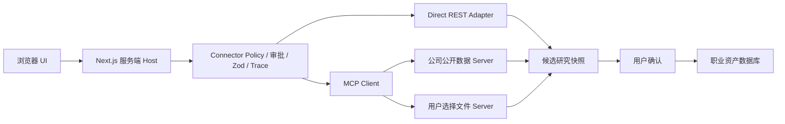

# MCP 技术决策

> 决策日期：2026-08-13
> 结论：MCP 值得作为后续可选外部连接层，但不应进入 V1.8 核心职业资产重构的关键路径。

## 1. 一句话判断

现在不需要“给项目挂一个 MCP”。更正确的顺序是：

1. 先完成项目—事实—能力—JD—话术的内部领域模型；
2. 定义与协议无关的 `ExternalConnector`；
3. 选择一个有真实价值的窄场景验证 MCP；
4. 首个场景只做只读公司公开信息研究，默认关闭、可追溯、可降级；
5. 验证 MCP 是否真的降低多数据源接入成本，再决定扩展。

## 2. MCP 是什么，不是什么

MCP 是 Host 与外部 Server 交换工具、资源和 Prompt 能力的标准协议。官方架构中，Host 管理多个 Client，每个 Client 连接一个 Server；协议不决定模型如何使用这些信息，也不替代应用自己的业务状态和权限策略。[MCP Architecture](https://modelcontextprotocol.io/docs/2026-07-28/learn/architecture)，访问 2026-08-13。

MCP 不是：

- Agent；
- 业务工作流；
- RAG；
- 数据库；
- 权限系统；
- 公司情报数据源；
- AI Provider 抽象；
- Flowise 的替代品。

它解决的是“如何用统一方式连接外部能力”，不解决“结论是否真实、何时调用、能否写库、如何评分”。

## 3. 当前项目是否缺 MCP

当前项目已有：

- 服务端 Direct LLM 适配、超时、Zod 校验和一次修复；
- 本机 Flowise 实验适配和 Mock 回退；
- 浏览器本地 PDF/DOCX 提取；
- localStorage 业务数据、IndexedDB Studio Trace、录音本地文件；
- TypeScript 状态机、确认门禁和工作流版本。

这些能力不因 MCP 获得明显收益。当前真正缺的是：原子事实、项目、能力、数字、Requirement 和真实依赖关系。因此 V1.8 主版本不应为了“技术完整”引入 MCP SDK。

## 4. 适合 MCP 的能力

### P0 试点：只读公司公开信息

建议窄工具：

```text
search_company(name, region)
get_company_profile(companyId, fields)
list_company_sources(companyId)
```

输出映射为 `CompanyResearchSnapshot`，每条事实必须带：

- `sourceUrl`
- `publishedAt`
- `retrievedAt`
- `sourceType`
- `confidence`
- `subjectMatchStatus`

MCP 只标准化连接，不代表数据授权合法，也不能证明返回信息真实。

### 后续候选

- 用户显式选择的 Google Drive、Notion 或本地目录，只读导入素材；
- 作品集发布到 Notion、Drive 或 GitHub，逐次预览确认；
- 固定查询的外部数据集或职业标准；
- 给开发者工具暴露不含真实简历的合成测评与发布记录。

## 5. 不适合 MCP 的能力

- 核心 TypeScript 工作流和状态机；
- 证据、能力、标签、熟练度和数字模型；
- ATS、诊断与面试评分；
- 补证问题路由和用户确认；
- 简历生成、编辑、模板和导出；
- Zustand/IndexedDB 业务 CRUD；
- 内部 RAG 索引；
- PDF/DOCX 本地导入；
- AI Provider 适配；
- Flowise 编排；
- 通用 HTTP、浏览器、Shell、SQL、文件系统或全盘搜索。

若目前只有一个自有 REST API，且不存在多个 Host 复用需求，直接服务端 adapter 更简单。

## 6. 推荐边界



### Host

Next.js 服务端业务执行器是 Host，负责 allowlist、审批、数据最小化、Zod、超时、回退、Trace 和写入门禁。浏览器和 Flowise 都不是权限真相。

### Client

服务端每个 Server 一个 Client/Connector。浏览器只提交有类型的研究任务和授权，不保存 token，也不直接连接 MCP Server。

### Server

按风险拆分：

- `company-public-data`：远程、只读；
- `workspace-files`：本地、只读、用户选择根目录；
- `portfolio-publisher`：远程写入，后续建设。

不要建设同时拥有私密简历、开放网络、文件系统和外部写权限的万能 Server。

## 7. 权限与确认

内部 `ConnectorPolicy` 是权限事实来源。MCP tool annotations 只能作为不可信 UI 提示，不能替代沙箱、网络隔离和运行时策略；官方也指出 annotations 无法消除 prompt injection，组合私密数据、不可信内容和外发能力会形成高风险链。[MCP Tool Annotations](https://blog.modelcontextprotocol.io/posts/2026-03-16-tool-annotations/)，访问 2026-08-13。

建议三档授权：

1. 封闭只读域、用户选文件：会话级授权；
2. 外部公开研究：每次研究任务展示 query、domain 和离开本机的数据；
3. 发布、写入和删除：每次调用预览并明确确认。

外部研究结果只能进入候选区，不能直接写成已确认事实。

禁止暴露 generic fetch、shell、browse-any-url、arbitrary SQL 和 write-file。读取外部网页后将会话标记为 `tainted`，后续外发或写操作强制再次确认。

## 8. 凭证与传输

- 凭证只存在服务端 OS 凭证库或加密本机配置；
- 不进入浏览器、Prompt、Trace、备份和 Git；
- 远程 OAuth 使用最小 scope 和 audience binding；
- 禁止 token passthrough；
- OAuth discovery 和回调实现 SSRF 防护；
- 本地 stdio Server 固定版本和校验和，限制环境变量并降低权限；
- 本机 HTTP 绑定 `127.0.0.1`，校验 Origin 并鉴权；
- 远程只使用 HTTPS。

官方安全最佳实践明确禁止 token passthrough，并要求关注 SSRF、最小权限和 token audience。[MCP Security Best Practices](https://modelcontextprotocol.io/docs/2026-07-28/tutorials/security/security_best_practices)，访问 2026-08-13。

MCP SDK 本身不是沙箱；stdio Server 通常与 Client 具有相同 OS 权限，文件、Git、数据库、网络和命令能力必须由部署方控制。[MCP Security Policy](https://github.com/modelcontextprotocol/modelcontextprotocol/security)，访问 2026-08-13。

## 9. 审计与降级

新增 `MCPSpan`，与 WorkflowTrace 关联但独立保存：

- correlation/run ID；
- server ID/version；
- tool；
- 脱敏或哈希后的参数；
- 授权 scope、确认时间；
- 开始/结束、耗时、状态和错误类型；
- 来源 URL 和时间；
- 字节数、截断与敏感标签。

永远不保存 Authorization、token 或整份敏感简历。

错误分类：`auth`、`offline`、`timeout`、`schema`、`rate-limit`、`denied`。只对幂等只读调用有限重试。公司研究失败时回退为用户粘贴 URL/手工事实；写入失败必须 fail closed，不能 Mock 写入。

## 10. 与其他技术的关系

| 技术 | 职责 |
|---|---|
| Skill | 规定如何访谈、分析、核验和输出 |
| TypeScript 工作流 | 决定何时调用、状态、门禁、写入、重试和回滚 |
| MCP | 标准化访问外部工具和资源 |
| RAG | 从已授权资料中检索相关片段 |
| 数据库 | 保存已确认事实与稳定关系，是事实系统 |
| Flowise | 实验性编排，可消费窄连接器但不能成为 Host 或数据真相 |

RAG 可以隐藏在一个 MCP tool/resource 后面，但仍必须返回来源、时间戳和权限过滤结果。业务数据库不能通过任意 SQL MCP 暴露。

## 11. 最小验证版本

建议在职业资产底座完成后做 V1.8.1 feasibility spike：

1. 定义 `ExternalConnector<TInput,TOutput>`、`ConnectorPolicy`、`ConnectorResult`、`CompanyResearchSnapshot` 和 `MCPSpan`；
2. 先实现 Direct/manual adapter；
3. 再使用当时最新、固定版本的 MCP TypeScript SDK 实现只读 company server/client；
4. feature flag 默认关闭；
5. 保留 Direct API/manual fallback；
6. 测试拒绝、未授权、超时、Schema 错误、恶意 tool 描述、网页 prompt injection、来源缺失、断网回退和幂等性。

成功标准：

- MCP 关闭时主流程完全相同；
- 每条外部事实都有来源；
- 候选不能自动进入已确认库；
- 凭证不进入客户端或 Trace；
- 与 Direct adapter 相比，接入第二个数据源时能显著减少专用胶水代码。

## 12. 规范版本注意

MCP 官方在 2026-07-28 发布了新规范方向，包括 stateless core、Minimum Required Transport Requirements、header routing 和授权加强。届时实现必须使用最新规范与 SDK，不应照搬旧版持久会话初始化示例。[MCP 2026-07-28 发布说明](https://blog.modelcontextprotocol.io/posts/2026-07-28/)，访问 2026-08-13。

如果未来通过 OpenAI Remote MCP 使用第三方 Server，数据会受到该 Server 自身留存和驻留政策影响，不能因为从 OpenAI API 发起就视为仍在本地。[OpenAI API Data Controls](https://developers.openai.com/api/docs/guides/your-data#default-usage-policies-by-endpoint)，访问 2026-08-13。
