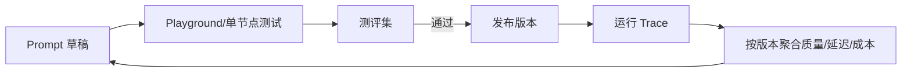

# 简历专家提示词与底层设定透明化研究报告

> 研究日期：2026-08-14
> 当前产品基线：`v1.9.1` / `0817dc6`
> 分析对象：简历专家开发者工作台、Dify、扣子编程/Coze Loop、Langfuse、Opik、Promptfoo、Agenta
> 聚焦范围：系统提示词、用户提示词、模型/Schema/工具设定、Markdown/源码可见性、版本、Diff、追踪和评测
> 本报告只做审视和研究，不包含下一版本规划，也不设计可修改功能。

## 一、执行摘要

你的判断是对的：当前开发者工作台虽然已经能看工作流、运行追踪、测评和发布记录，但还没有真正把“模型为什么这样运行”透明化。

最关键的问题不是缺少一个文本查看器，而是缺少一条可信映射：

```text
工作流节点
  → Prompt 身份与版本
  → 系统/用户消息模板
  → 变量、Schema、模型、工具和 Provider 适配
  → 本次实际发送给模型的最终消息
  → 输出、错误和测评结果
  → 对应源码与 Markdown 依据
```

当前产品只覆盖了这条链的两端：能看到节点，也能看到部分输入输出；中间的 Prompt 身份、模板、运行时解析结果和源码依据没有被连接起来。

外部案例的共同结论是：

- **Dify** 最擅长在工作流节点上下文中展示 Prompt、变量、Schema 和单节点运行。
- **Coze Loop** 最擅长把 Prompt 作为独立资产，管理 Draft、Commit、Version、Diff、Playground、Eval 和 Trace。
- **Langfuse/Opik** 最擅长让运行记录绑定“确切使用的 Prompt 版本”。
- **Promptfoo** 最擅长 Prompt-as-Code 的本地测评和回归矩阵。
- **Git/代码浏览器** 仍然负责任意 `.md` 和源码；上述平台没有一个会自动、安全地把任意仓库文件都当 Prompt 管理。

因此，市场上没有一个可以直接接入后就完全满足你的目标的现成平台。最接近的不是“再装一个 Dify”，而是把四种成熟做法组合起来，同时保持 TypeScript 仍是本项目唯一业务事实源。

## 二、当前开发者工作台自审

### 2.1 已经具备的能力

| 能力 | 当前状态 | 证据 |
|---|---|---|
| 工作流地图 | 已有 | `src/components/studio/workflow-studio.tsx` |
| 受约束节点设置 | 已有 | Provider、模型、Prompt 版本标签、超时、人工确认 |
| 草稿测试、发布、回滚 | 已有 | `src/lib/studio/workflow-release.ts` |
| 运行追踪 | 已有 | 输入、输出、耗时、Provider、模型、错误 |
| Trace 隐私和容量治理 | 已有 | 脱敏、单条截断、50 次/30 天/50MB |
| Mock 与真实测评 | 已有 | `evals/` 及 Studio 测评中心 |
| 开发记录 | 已有 | 发布目标、模块、测试和提交 |
| TypeScript/Zod 门禁 | 已有 | 结构化输出、一次修复、错误分类 |

这些能力说明工作台已经有一个好的工程骨架，并不需要推倒重做。

### 2.2 当前真实提示词在哪里

| 类型 | 位置 | 透明度问题 |
|---|---|---|
| 简历系统提示词 | `src/lib/ai/prompts.ts` | Studio 不显示正文，也没有稳定 Prompt ID |
| 深度 JD/匹配/面试策略 | `src/lib/ai/jd-prompts.ts` | 一个工作流“分析”节点实际对应多份用户提示词 |
| 面试复盘 | `src/lib/ai/interview-prompts.ts` | 不在默认工作流三条 Prompt 标签中 |
| 项目访谈 | `src/lib/career/interview.server.ts` | 系统提示词直接内联在调用代码中 |
| 简历导入 | `src/services/ai/importResume.server.ts` | 内联提示词未进入 Studio 目录 |
| Flowise 回退 | `src/lib/flowise/client.server.ts` | Studio 只能看到 Provider，不能看到回退 Prompt |
| JSON Schema 注入/修复 | `src/lib/ai/client.ts` | 最终 system 消息会被运行时追加，源码模板不是最终请求 |

代码扫描发现 12 个导出的 Prompt 构造器，另有多个内联和运行时注入 Prompt。有些旧构造器可能已不在当前执行路径，但现在也没有自动检测“在用/未用”的机制。

### 2.3 `Prompt 版本` 目前不是真正的版本

默认工作流写有 `analysis-v1`、`interview-v1` 和 `optimize-v1`。它们目前只是自由字符串：

- 没有绑定具体文件和导出符号；
- 没有绑定内容哈希；
- 没有证明一次分析实际用了哪些 Prompt；
- 没有记录变量、Schema、模型参数和工具配置；
- 修改源码后标签不会自动变化；
- Trace 无法用该标签复现当次完整请求。

因此它更像“人为备注”，还不是可审计版本。

### 2.4 Trace 只记录业务输入输出，不记录运行时 Prompt

`WorkflowSpan` 当前有节点、模式、Provider、模型、时间、输入、输出、错误和截断标志，但没有：

- Prompt ID/版本/内容哈希；
- 原始 System/User 模板；
- 变量解析后的最终消息；
- 注入后的 JSON Schema；
- Provider 适配策略；
- 是否发生结构修复及修复 Prompt 版本；
- 工具定义或输出 Schema 版本。

这意味着当结果变差时，只能看到“用了哪个模型、输入输出是什么”，不能准确回答“模型究竟收到了什么”。

### 2.5 Markdown 资产现状

当前 Git 跟踪 27 个 `.md` 文件，包含 README、CHANGELOG、工作流说明、Flowise 说明以及大量研究和规格文件。它们目前只能通过编辑器/Git 查看，Studio 没有：

- 文件目录和分类；
- 渲染预览与原文切换；
- 文件与工作流节点/Prompt 的引用关系；
- 最近修改、Git 提交和影响范围；
- “运行时是否真正读取了该文件”的证据。

未跟踪的 `prd/` 按既有项目边界未纳入本次清点，也没有读取或修改。

## 三、Dify：Prompt 属于工作流节点

### 3.1 它怎么做

Dify 的 LLM 节点把以下配置放在同一个节点面板中：

- System、User、Assistant 消息角色；
- `{{variable}}` 变量和上下文变量；
- Jinja2 模板；
- 模型和采样参数；
- 可视化或原始 JSON Schema 结构化输出；
- 重试、回退与错误路由。

官方文档还提供：

- Current Draft、Latest Version、Previous Versions；
- 发布、命名版本、发布说明和恢复；
- 单节点运行；
- 修改缓存输入后重新运行当前节点；
- Run History 中查看节点顺序、输入、输出和耗时；
- 可发布、可恢复的 Snippet 节点组；
- YAML DSL 导入导出。

来源：[LLM 节点](https://docs.dify.ai/en/cloud/use-dify/nodes/llm)、[版本控制](https://docs.dify.ai/en/cloud/use-dify/build/version-control)、[Snippets](https://docs.dify.ai/en/cloud/use-dify/build/snippet)、[单节点调试](https://docs.dify.ai/en/cloud/use-dify/debug/step-run)、[运行历史](https://docs.dify.ai/en/cloud/use-dify/debug/history-and-logs)、[GitHub](https://github.com/langgenius/dify)。

### 3.2 值得学习的点

Dify 最好的设计不是“拖拽”，而是让节点的 Prompt、变量、Schema、模型和最近一次运行处于同一上下文。用户不需要在代码、日志和工作流之间来回猜测。

### 3.3 不适合直接照搬的点

- Prompt 主要是节点配置，跨节点共享需要 Snippet/DSL 等另一套机制。
- 工作流版本与 Git 源码版本是两套系统。
- 官方 Run History 明确展示输入、输出和数据流，但没有明确保证展示 Provider 适配、Schema 注入后的最终完整请求消息。
- 它不是任意 TypeScript/Markdown 仓库浏览器。

对简历专家而言，Dify 更适合作为交互范式参考，而不是新的事实源。

## 四、扣子编程与 Coze Loop：必须分开看

### 4.1 扣子编程

[扣子编程官网](https://code.coze.cn/)公开定位为 AI 开发伙伴和 Vibe Coding 基础设施，支持自然语言开发智能体、工作流、网页和移动应用并部署。

但公开首页是动态站点，当前可访问的一手材料不足以核验以下细节：

- 是否有跨项目的完整 Prompt 注册表；
- 是否保存最终运行时 System/User 消息；
- 是否自动列出全部 Markdown/源码设定；
- 是否能把源码位置、版本、Trace 和 Eval 精确关联。

所以不能因为它能“自然语言改代码”，就推断它已经实现你要的底层透明化；也不能把 Coze Loop 的功能直接算到扣子编程上。

### 4.2 Coze Loop

Coze Loop 的公开代码给出了更清晰、可验证的做法。它把 Prompt 作为一级领域对象，而不是工作流节点里的普通字符串：

- `PromptDraft` 与 `PromptCommit` 分离；
- Commit 保存 `version`、`base_version`、说明、提交人和时间；
- Prompt Detail 同时保存消息、变量、模型配置、工具配置和 MCP 配置；
- 角色支持 System、User、Assistant、Tool、Placeholder；
- 模板支持 Normal、Jinja2、GoTemplate 和自定义类型；
- Prompt 可设置 L1-L4 安全等级；
- Diff 同时比较消息、变量、元数据、模板类型、模型参数和工具；
- Playground 支持调试和模型对比；
- Eval 管理数据集、评估器和实验；
- Trace 覆盖 Prompt 解析、模型和工具调用；
- SDK 可按 PromptKey 获取并格式化 Prompt。

来源：[Coze Loop Wiki](https://github.com/coze-dev/coze-loop/wiki/1.-%E4%BB%80%E4%B9%88%E6%98%AF-Coze-Loop)、[Prompt 数据模型](https://github.com/coze-dev/coze-loop/blob/main/frontend/packages/loop-base/api-schema/src/api/idl/prompt/domain/prompt.ts)、[Prompt Diff 源码](https://github.com/coze-dev/coze-loop/blob/main/frontend/packages/loop-components/prompt-components-v2/src/components/prompt-diff/diff-content.tsx)、[CozeLoop Go SDK](https://github.com/coze-dev/cozeloop-go)。

### 4.3 最有价值的启示

Coze Loop 证明了 Prompt 版本不应该只是 `analysis-v1` 这样的标签，而应该是包含内容、变量、模型、工具、模板类型和安全等级的可比较对象。

它同样没有把任意仓库文件自动纳入 Prompt 管理。只有显式注册的 Prompt 才具备这些能力。

## 五、GitHub 开源案例

### 5.1 Langfuse：Prompt 注册与运行版本关联

Langfuse 把 Prompt 从代码中抽出，支持：

- Text/Chat Prompt；
- 变量、Prompt 引用和消息占位；
- 每次修改生成不可变数字版本；
- `latest`、`production` 和自定义标签；
- Playground 并排比较多个 Prompt/模型组合；
- 把某次生成明确关联到所用 Prompt 版本；
- 按 Prompt 版本汇总延迟、Token、成本、次数和评分；
- 通过改标签快速发布和回滚。

来源：[Prompt Management](https://langfuse.com/docs/prompt-management/overview)、[数据模型](https://langfuse.com/docs/prompt-management/data-model)、[Playground](https://langfuse.com/docs/prompt-management/features/playground)、[Trace 关联](https://langfuse.com/docs/prompt-management/features/link-to-traces)、[Prompt 组合](https://langfuse.com/docs/prompt-management/features/composability)、[GitHub](https://github.com/langfuse/langfuse)。

需要注意两点：Prompt 与代码会形成两个事实源；SDK 缓存还可能让刚更新后的少量运行继续使用旧版本。Langfuse 通过版本/标签/Trace 缓解这个问题，但不会自动消除它。

### 5.2 Opik：Prompt Library 与本机 Agent Playground

Opik 的 Prompt Library 支持自动版本化、固定版本复现和确切版本 Trace。Agent Playground 可以连接本机运行的 Agent，在 UI 中调整 Prompt/参数并查看每个 LLM、工具和子步骤的完整 Trace。

它还提供 `opik connect` 让 Agent 读取代码并提出修改。这是本次调研中最接近“应用界面连接源码”的案例，但它仍是 Agent 辅助开发能力，不是自动、静态、可信的全仓库 Prompt/Markdown 清单。

来源：[Prompt Library](https://www.comet.com/docs/opik/latest/development/prompt-library/getting-started)、[Agent Playground](https://www.comet.com/docs/opik/latest/development/agent-playground)、[GitHub](https://github.com/comet-ml/opik)。

### 5.3 Promptfoo：Prompt-as-Code 与测评矩阵

Promptfoo 允许通过 `file://prompt.txt` 读取 Git 中的 Prompt，用 YAML 定义 Provider、变量、案例和断言；执行后在 Web Viewer 中查看：

- Prompt × 模型 × 案例矩阵；
- 通过/失败/错误筛选；
- Token、延迟和成本；
- 通过率和分数分布；
- 两个 Prompt 的逐案例对比。

来源：[配置指南](https://www.promptfoo.dev/docs/configuration/guide/)、[Web Viewer](https://www.promptfoo.dev/docs/usage/web-ui/)、[GitHub](https://github.com/promptfoo/promptfoo)。

它很适合作为 Git 内 Prompt 的测试门禁，但不负责生产 Prompt 版本、工作流映射或任意 Markdown 审计。

### 5.4 Agenta：一体化 LLMOps

Agenta 将 Playground、Prompt 和复杂配置版本、分支/环境、评测、人工反馈和 Trace 放在一套平台里。它证明多人团队确实需要 Prompt 版本和应用配置一起管理。

但这类完整 LLMOps 对当前本机个人应用较重，会引入账户、服务、数据库、权限和第二套发布系统。

来源：[Agenta GitHub](https://github.com/Agenta-AI/agenta)。

## 六、横向能力矩阵

图例：✅ 明确支持；◐ 部分支持或需要组合；— 不是其目标能力；? 公开证据不足。

| 能力 | 简历专家当前 | Dify | Coze Loop | Langfuse | Opik | Promptfoo | Agenta |
|---|---:|---:|---:|---:|---:|---:|---:|
| System/User/Assistant 可见 | — | ✅ | ✅ | ✅ | ✅ | ◐ | ✅ |
| 变量与模型配置同屏 | — | ✅ | ✅ | ✅ | ✅ | ◐ | ✅ |
| 输出 Schema 可见 | — | ✅ | ◐ | ✅ | ◐ | ◐ | ◐ |
| Prompt 独立身份 | — | ◐ | ✅ | ✅ | ✅ | 文件名 | ✅ |
| 不可变版本/标签 | 自由字符串 | 工作流版本 | ✅ | ✅ | ✅ | Git | ✅ |
| Prompt 内容 Diff | — | 工作流级 | ✅ | 版本级 | 版本级 | Git Diff | ✅ |
| 精确绑定运行版本 | — | ◐ | ✅ | ✅ | ✅ | Eval 配置 | ✅ |
| 单节点/Playground 调试 | — | ✅ | ✅ | ✅ | ✅ | Eval UI | ✅ |
| 测评门禁 | Mock 基线/命令 | ◐ | ✅ | ✅ | ✅ | ✅ | ✅ |
| 工作流画布 | ✅ | ✅ | — | — | Agent 图 | — | ◐ |
| 任意 `.md`/源码目录 | — | — | — | — | ◐ Agent 桥接 | 指定文件 | — |
| 本机个人应用适配 | ✅ | ◐ 自托管较重 | ◐ 自托管较重 | ◐ | ◐ | ✅ | ◐ 较重 |

这个矩阵说明：“提示词平台”和“代码/文档透明化平台”是两个相邻但不同的问题。主流产品擅长前者，没有产品自动解决后者。

## 七、行业共同架构模式

### 7.1 Prompt 必须是一级资产

成熟系统不会只保存一个 `promptVersion` 字符串，而会保存：

- 稳定 ID 和名称；
- System/User/Assistant 消息；
- 变量定义；
- 模型参数；
- 输出 Schema；
- 工具配置；
- 版本、父版本、说明和作者；
- 安全级别和敏感性；
- 内容哈希。

### 7.2 模板与运行时快照必须分开

“模板”是源代码或注册表中的内容；“运行时快照”还包含实际变量、Provider 兼容注入、JSON Schema、工具和修复指令。

只展示模板会给用户一种虚假的透明感。真正可复现的是运行时快照，但其中可能包含简历和个人经历，因此需要脱敏、折叠和本机保存。

### 7.3 版本必须与 Trace 和 Eval 形成闭环

行业最佳实践不是“能看历史”，而是：



这张图说明 Prompt 透明化不是静态文档功能，而是开发、测试、发布、运行和复盘的闭环。当前简历专家已有 B/C/D/E 的部分骨架，但缺少统一的 Prompt 身份连接它们。

### 7.4 Markdown/源码应是独立 Source Catalog

任意 `.md` 和源码包含说明、规范、研究材料甚至可能含敏感信息。把它们全部当 Prompt 会带来三个错误：

1. 误以为文件存在就代表运行时读取了它；
2. 把业务文档修改与 Prompt 发布混成同一种风险；
3. 扩大浏览器可访问的文件范围。

更准确的概念是 Source Catalog：只显示允许范围内的仓库文件、Git 状态、引用关系和“是否被运行时使用”的证据。Prompt Registry 与 Source Catalog 可以互相链接，但不应混为一个对象。

## 八、MCP 是否必要

本次目标不需要 MCP 才能实现透明化。

Langfuse 已提供 MCP，让编码 Agent 创建 Prompt 版本、移动标签等，但它建立在已经存在的 Prompt Registry 之上。MCP 只是外部 Agent 的访问协议，不会自动完成：

- 扫描并识别哪些字符串是真正 Prompt；
- 判断哪些 Markdown 是业务依据；
- 生成可信的源码—节点—运行映射；
- 处理本机敏感简历内容；
- 决定修改后必须跑哪些测评。

所以 MCP 对“以后让 Codex/其他 Agent 查询已注册 Prompt”可能有价值，对当前透明化底座不是前置条件。先有可信目录和权限边界，再讨论是否通过 MCP 暴露，是更稳妥的顺序。

## 九、最终判断

### 9.1 你的需求有没有成熟案例？

有，但被拆散在不同产品中：

- Dify 给出了工作流节点内透明化；
- Coze Loop 给出了 Prompt 领域模型和 Diff；
- Langfuse/Opik 给出了 Prompt 版本与 Trace 的精确关联；
- Promptfoo 给出了 Git 文件和测评矩阵；
- Git/代码浏览器给出了任意源码和 Markdown 审计。

没有一款产品把这些完整合并，并且同时适合本机简历应用。

### 9.2 当前项目处于什么水平？

当前项目不是“没有开发台”，而是已经完成了平台骨架，却缺少最关键的 Prompt 资产层：

- 工作流有版本，Prompt 没有可信版本；
- Trace 有输入输出，缺少最终 Prompt；
- 测评有案例，缺少 Prompt 版本维度；
- 文档很多，缺少来源目录和运行引用；
- UI 能改 `promptVersion`，但这个字段不等于真实 Prompt 内容。

### 9.3 最值得坚持的原则

1. TypeScript 继续是业务工作流唯一事实源。
2. Prompt 内容、运行时注入和输出 Schema 都要进入可审计范围。
3. “看得到模板”与“看得到实际请求”必须明确区分。
4. Prompt、Trace、Eval 和发布版本必须用稳定身份连接。
5. Markdown/源码透明化使用独立 Source Catalog，不伪装成 Prompt 管理。
6. 不展示模型隐藏思维链；透明化对象是开发者编写的指令、配置、工具、Schema、输入输出和错误。
7. MCP 不是前置条件，也不能替代本地权限与来源治理。

## 十、研究边界与可信度说明

- 当前产品结论来自 `v1.9.1` 本地源码，只读审计；没有修改应用功能。
- Dify、Coze Loop、Langfuse、Opik、Promptfoo 和 Agenta 结论优先采用官方文档、官方 GitHub 与源码。
- 扣子编程官网公开内容有限，报告只确认其公开定位；未确认的内部能力明确标记为“公开证据不足”。
- GitHub 最新版本信息是 2026-08-14 的快照，会随发布变化，不影响架构结论。
- 本报告没有把产品宣传、第三方文章或模型推断当作已验证功能。

## 主要来源

- [Dify LLM Node](https://docs.dify.ai/en/cloud/use-dify/nodes/llm)
- [Dify Version Control](https://docs.dify.ai/en/cloud/use-dify/build/version-control)
- [Dify Run History](https://docs.dify.ai/en/cloud/use-dify/debug/history-and-logs)
- [Dify GitHub](https://github.com/langgenius/dify)
- [扣子编程](https://code.coze.cn/)
- [Coze Loop GitHub](https://github.com/coze-dev/coze-loop)
- [Coze Loop Prompt 数据模型](https://github.com/coze-dev/coze-loop/blob/main/frontend/packages/loop-base/api-schema/src/api/idl/prompt/domain/prompt.ts)
- [Coze Loop Prompt Diff](https://github.com/coze-dev/coze-loop/blob/main/frontend/packages/loop-components/prompt-components-v2/src/components/prompt-diff/diff-content.tsx)
- [Langfuse Prompt Management](https://langfuse.com/docs/prompt-management/overview)
- [Langfuse Link Prompts to Traces](https://langfuse.com/docs/prompt-management/features/link-to-traces)
- [Opik Prompt Library](https://www.comet.com/docs/opik/latest/development/prompt-library/getting-started)
- [Promptfoo Configuration](https://www.promptfoo.dev/docs/configuration/guide/)
- [Agenta GitHub](https://github.com/Agenta-AI/agenta)
