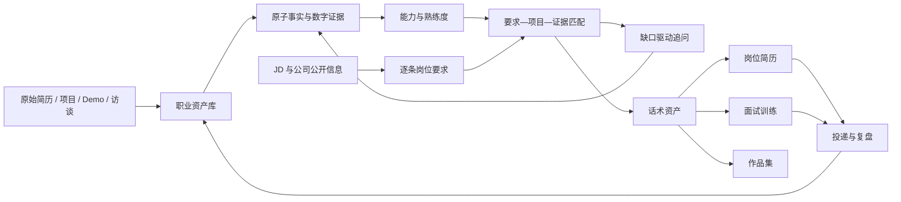

# 简历专家产品与技术研究报告（本地审计版）

> 审计基线：`main` / `v1.7.2` / `f83bb1a`  
> 报告状态：本地代码、运行截图、商业产品、GitHub/标准与 MCP 架构研究均已完成。  

运行抽查：本机应用与 Flowise 状态接口均返回 HTTP 200；现有 5 项核心 Playwright 回归全部通过。通过只证明既有流程可操作，不覆盖本报告发现的证据链和状态失效缺陷。

## 1. 执行摘要

用户提出的方向整体合理、可落地，也具有明确价值。但它不是“再增加一些简历功能”，而是要求产品从岗位定制简历工作台升级为个人职业资产与证据系统。

最值得建立的核心闭环是：

```text
可核验个人事实
→ 项目 / 经历 / Demo
→ 能力、熟练度与数字证据
→ JD 逐条要求
→ 可信匹配与缺口访谈
→ 简历、面试话术与作品集
→ 投递和面试反馈
→ 个人资产持续更新
```

当前产品已经有很好的外壳：本地文档、导入、岗位版本、简历编辑、模板、导出、基础证据库、ATS、投递、面试复盘、AI 测评、Trace、Studio 和 Flowise 实验都存在。真正的短板是底层事实关系：当前证据仍以大段文本为主，部分关联依赖模糊词命中，材料变化与依赖失效没有完全贯通。

因此建议：

1. 先发布 V1.7.3，修复会造成旧分析、虚高 ATS、虚假 Mock、证据断链和恢复丢失的可信度问题。
2. V1.8 系列重构职业资产、原子事实、数字证据、能力标签和熟练度。
3. V1.8.2 再做 JD 逐条分析、自适应追问和项目排序。
4. V1.9 完成面试训练、统一话术、教育扩展、作品集和投递反馈。
5. V2.0 才建设有来源、有时效的公司公开情报，并按需要引入受控 RAG。

## 2. 用户价值判断

### 2.1 为什么有价值

普通简历生成工具优化的是一份文本；用户设想优化的是一个长期复用的个人事实和表达系统。它可以解决四个长期问题：

- 用户不知道自己做过什么、能力体现在哪里；
- 同一个项目在简历、面试和作品集中说法不一致；
- 针对新 JD 每次都从头回忆，不能复用历史材料；
- AI 容易产生看似漂亮但无法核验的数字和成果。

### 2.2 价值最高的差异化

1. **项目访谈与事实拆解**：帮助用户从模糊叙述中找回背景、角色、动作、决策、结果和证据。
2. **能力—项目—证据绑定**：能力标签不是用户随意点选，而是能展开查看支持它的项目与事实。
3. **JD 逐条映射**：每条岗位要求都有对应项目、证据强度、缺口问题和面试准备。
4. **多渠道话术一致性**：简历 bullet、一句话介绍、STAR 故事、面试深挖和作品集引用同一组事实。
5. **事实风险控制**：数字有公式和来源，事实变化会让下游内容过期，AI 示例不会变成用户经历。

### 2.3 不应作为核心卖点的能力

- “预测录用概率”；
- 模拟真实 ATS 的通过分数；
- 无来源判断领导人格、HR 背景或公司内部关系；
- 一个 Agent 自动完成研究、改写、评分、投递和数据写入；
- 仅通过更多 Prompt 风格制造差异。

## 3. 当前产品评估

### 3.1 已有优势

- 个人本地版，不强制账号和云同步；
- 多岗位文档、版本和本地恢复；
- PDF/DOCX 导入及结构化草稿；
- 三套 ATS 友好模板和统一预览/打印/DOCX 配置；
- AI 输出 Zod 校验、一次修复、超时和错误分类；
- 本地 ATS 就绪度、最终简历确认门禁；
- 投递和面试复盘；
- 24 个合成测评案例；
- Studio、运行追踪、Flowise 实验和受约束工作流发布。

这证明项目不是单次 Prompt 包装器，而是有状态、门禁、版本、交付和可观测性的产品。

### 3.2 必须优先处理的可信度问题

完整问题见[当前产品与代码审计](./current-product-audit.md)。最关键的十项是：

1. ATS 把“希望突出能力”拼入正文，导致关键词得分虚高。
2. 修改 JD、岗位或原简历后，旧分析仍被当成当前结果。
3. Mock 对任意输入都可能生成固定“张明”虚假简历并允许导出。
4. 证据通过短词重合自动关联，人工改写后仍保留旧引用。
5. 修改或删除证据不会使依赖简历过期。
6. 备份合并更换 ID 后没有重写 bullet 的证据外键。
7. 损坏恢复会把证据、投递和面试复盘强制清空。
8. 同一个追问重复生成会不断增加重复证据候选。
9. 所有已确认证据无筛选地发给每个岗位 AI。
10. Flowise 草稿合并为一条候选并丢失逐事实来源。

这些问题意味着当前 UI 中“已确认”“关联证据”“ATS 分数”和“已完成”有时强于实际数据能够证明的程度。V1.7.3 应先消除这一差距。

## 4. 产品设计原则

### 4.1 六类信息必须分层

| 类型 | 示例 | 产品处理 |
|---|---|---|
| 用户确认事实 | 公司、角色、日期、动作、可复核数字 | 可进入简历与话术 |
| 用户自评 | 熟练度、偏好、未来方向 | 显示为自评，不伪装为业绩 |
| 公开企业事实 | 工商、融资、诉讼、官网信息 | 必须有来源和采集时间 |
| 公开信号 | 新闻、招聘变化、展会、公众号 | 可支持判断，不等于内部事实 |
| 系统推断 | 团队痛点、工作重心、潜台词 | 显示依据、置信度和替代解释 |
| 主观样本 | 在职体验、氛围、管理评价 | 标记来源与样本偏差，不做确定结论 |

### 4.2 原子确认

用户确认的单位应是一条事实或一个数字，而不是整份 AI 输出。每个 AI 产物至少保存：

- `sourceIds`
- `generationMode`
- `promptVersion`
- `confidence`
- `userDecision`
- `createdAt`
- `supersedesId`

### 4.3 用户控制与可撤销

自动标签、项目匹配、优化建议和公司推断都先作为候选。用户可以采用、编辑、拒绝并看到依据。所有发布版本都可回滚。

### 4.4 推断必须可见

“可能的团队痛点”不能在视觉上与“JD 明文要求”相同。建议统一使用事实、公开信号、推断、未知四种视觉标签。

## 5. 推荐产品结构



建议一级导航逐步演进为：

- 求职工作台：材料、分析、制作、交付；
- 职业资产：项目、经历、事实、能力、数字、附件；
- 面试训练：题库、抽题、回答、修订、证据缺口；
- 投递复盘：岗位、公司、阶段、结果、改进任务；
- 公司研究：公开资料、风险、招聘与面试反问；
- 开发者工作台：工作流、Trace、测评、Flowise 和版本。

完整页面结构见[页面与交互信息架构](./information-architecture.md)。

## 6. 推荐领域模型

不应继续把所有内容扩进 `ResumeDocument`。建议独立建立：

```text
CareerProject / CareerExperience
  └─ EvidenceClaim
       ├─ EvidenceSource
       ├─ MetricEvidence
       └─ RiskFinding

Capability ─ ProjectCapabilityLink ─ CareerProject
Capability ─ CapabilityEvidence ─ EvidenceClaim

JobTarget ─ JDRequirement
JDRequirement ─ RequirementEvidenceMatch ─ EvidenceClaim / CareerProject

NarrativeAsset
  ├─ resume-bullet
  ├─ one-line-project
  ├─ interview-story
  └─ portfolio-section

CompanyResearchSnapshot ─ ResearchSource
QuestionSession ─ AnswerRevision
```

简历版本应保存所选资产的快照和来源引用。事实变化时，通过依赖索引将有关简历、话术和作品集标为 `stale`，不能只在 UI 展示一个来源标签。

字段级建议见[职业资产领域模型](./domain-model-spec.md)。

## 7. 技术路线

### 7.1 数据库

需要数据库，但现在不需要云数据库。

推荐：

1. 先定义 TypeScript + Zod 领域模型；
2. 业务数据迁移到 IndexedDB/Dexie；
3. 附件用独立 Blob 存储，只在记录中保存元数据和引用；
4. 保留 JSON 全量/局部备份和恢复预览；
5. 桌面化或数据规模明显增长后再评估本机 SQLite；
6. 账号与多端同步得到验证后才考虑 Postgres/云数据库。

### 7.2 Skills

需要 Skills。适合的独立 Skill：

- 项目和经历访谈；
- Demo 结构化拆解；
- 能力标签与熟练度校验；
- 数字口径与证据教练；
- JD 逐条分析；
- 公司公开资料研究；
- 面试回答教练。

Skill 输出候选结构，经 Zod 校验和用户确认后，由 TypeScript 写库。Skill 本身不拥有写入已确认事实的权限。

### 7.3 工作流与 Agent

固定 TypeScript 工作流必须保留，负责状态、超时、错误、门禁、写入、版本、评测和回滚。

Agent 适合：

- 根据回答决定下一最佳问题；
- 在多个项目中选择最值得深挖的对象；
- 根据 JD 选择访谈分支；
- 给出回忆线索与回答框架；
- 产生候选项目、标签、数字和话术。

Agent 不适合：

- 自动把生成内容写成已确认事实；
- 同时承担公司研究、简历生成、评分和投递；
- 绕过材料、证据、最终简历和导出门禁。

### 7.4 RAG

RAG 不是当前第一步。

个人项目、能力、标签、数字和岗位要求应先使用结构化字段、关系、全文关键词和确定性排序。只有以下场景需要 RAG：

- 大量项目长文档与作品集片段；
- 能力词表和同义词资料；
- 历史面试和长篇复盘；
- 公司公开资料快照。

第一阶段使用结构化过滤 + BM25；召回不足时再增加 embedding。每个结果必须返回稳定对象 ID、来源片段和时间，不能把检索文本直接当作已确认事实。

### 7.5 Flowise

Flowise 适合作为实验层：项目访谈、动态分支、同案例对比和新 Skill 原型。它不应接管文档库、证据库、评分、导出和迁移。

### 7.6 MCP

MCP 值得保留为未来的外部连接标准，但不应进入 V1.8 核心证据系统。它解决的是 Host 与外部工具/资源之间的互操作，不是 Agent、工作流、RAG、数据库或 AI Provider 的替代品。

推荐顺序：先建立与协议无关的 `ExternalConnector` 和公司研究 Schema，再在 V1.8.3 用默认关闭的 feature flag 验证一个“只读公司公开信息”连接器。浏览器不持有凭证、不直连 MCP，所有候选结果都需服务端 Schema、来源记录、审计和用户确认。完整决策见[MCP 技术决策](./mcp-decision.md)。

## 8. 外部产品与开源研究结论

外部市场大致分成三条未完全打通的链：Teal、Rezi、Kickresume、Huntr 等偏材料和职业工作台；LinkedIn、Indeed、BOSS 等偏职位发现、匹配和投递；Glassdoor、脉脉、企查查、天眼查等偏公司体验或公开企业信息。

最接近本项目目标的商业模式是 Huntr 的“Master Resume → 岗位定向版本 → Application Packet”，但本项目需要进一步把每个输出绑定到原子事实和版本依赖。Teal 的投递/面试工作台、Rezi 的可执行检查、Kickresume 的制作体验都有局部价值，均不能替代真实性门禁。完整对照见[商业产品与市场能力对照](./external-product-analysis.md)。

开源与标准方面：

- 借鉴 Reactive Resume 的版本化结构、最小修改和锁；
- 借鉴 Resume Matcher 的母版到岗位版本、差异和区块级重生成；
- 用 ESCO 的稳定技能标识/别名做可选规范骨架；
- 用 O*NET 的量表思想分离“岗位重要性”“用户自评”和“证据校验水平”；
- 保留 Flowise 为实验层，暂不增加 Dify；只有动态 Agent 跨会话恢复成为真实需求时再评估 LangGraph。

完整结论与许可证/维护风险见[开源案例、职业标准与编排框架研究](./open-source-and-standards.md)，全部公开证据见[来源目录](./source-catalog.md)。

## 9. 关键功能设计

### 9.1 项目 / Demo 梳理

一个项目至少包含：背景、目标、利益相关者、用户角色、个人边界、约束、决策、行动、产出、结果、数字口径、失败与权衡、能力、附件、面试版本和事实状态。

支持新增、删除、复制、排序、归档和版本。用户不知道怎么写时，系统按缺失字段逐步问，而不是一次展示大表单。

### 9.2 能力标签与熟练度

使用规范标签、用户标签、JD 标签三层结构。熟练度采用 0–4 行为标尺，并并列显示用户自评与证据校验等级。完整标准见[评分与证据链建议规范](./scoring-and-evidence-spec.md)。

### 9.3 JD 深度解析

每条 Requirement 应保存原文锚点、类型、权重、期望行为、期望产出、业务场景、行业经验、隐性假设、证据标准、面试问题和反向提问。

潜台词、团队现状、工作重心、业务线和汇报关系必须标记为推断，并显示推断依据、置信度和其他可能解释。

### 9.4 自适应补证

问题数量由高权重要求覆盖、证据强度、回答质量和边际信息增益决定，不固定 5–7 道。不会回答时依次提供回忆线索、回答框架、明确标为虚构的示例和稍后补充任务。

### 9.5 面试训练

题目从 JD Requirement、项目和风险点生成；支持随机抽卡、按薄弱项训练和模拟追问。用户先回答，再看结构建议和对比评分。任何新事实回到候选区逐项确认，不能直接覆盖资产库。

### 9.6 优化与人工编辑

将固定“风格枚举”升级为可组合参数：精炼程度、技术细节、业务结果、风险克制、岗位语气、长度和关键词密度。AI 可以推荐组合并解释原因。每条建议可采用、拒绝或编辑，保留版本链。

### 9.7 教育与继续教育

教育改为数组，支持课程、GPA、荣誉、证书、继续教育和进修。系统根据求职阶段、岗位要求和版面空间建议显隐。未来规划通常保存在偏好或面试话术中，不应默认写进简历。

### 9.8 投递分析

除了状态数量，应展示阶段漏斗、阶段耗时、失败原因、渠道、岗位族和简历版本对比。只描述相关性和变化，不承诺某种简历导致 Offer。

### 9.9 公司研究

公司研究必须是独立模块，分为工商/资本、业务/新闻、招聘/薪酬、司法/知识产权、公开内容和主观样本。每条信息有来源、采集时间、可信度、冲突和过期状态。

领导人格、喜好、HR 私人背景、内部关系不能由模型无来源推断。匿名体验只能作为主观样本，不得自动汇总成确定性结论。

来源分类、时效和隐私边界见[目标公司公开研究模块规范](./company-research-spec.md)。

## 10. 评分与证据标准

当前 ATS 的 40% 关键词、30% 经验证据、20% 量化成果、10% 完整度可以保留为框架，但必须修复输入污染并升级证据与数字算法。AI 诊断分应改为固定 rubric，由本地计算器汇总模型提供的 finding。

详细标准见[评分与证据链建议规范](./scoring-and-evidence-spec.md)，包括：

- 简历诊断五维评分；
- ATS 子项算法；
- 证据链完整度；
- 熟练度 0–4 标尺；
- 面试回答评分；
- 自适应追问停止条件。

## 11. 路线图

建议版本顺序：

1. V1.7.3：可信度修复；
2. V1.8.0：职业资产与原子证据；
3. V1.8.1：能力标签与熟练度；
4. V1.8.2：JD 深度分析与定向访谈；
5. V1.8.3：外部连接器与只读 MCP 可行性切片；
6. V1.9.0：多渠道话术、面试训练、教育和作品集；
7. V1.9.1：投递反馈闭环；
8. V2.0：目标公司公开情报和可选 RAG。

各版本范围与成功指标见[推荐版本路线图](./roadmap.md)。

逐版本权威验收证据见[后续建设验收矩阵](./acceptance-matrix.md)。

## 12. 最终判断

用户的想法不是不切实际，而是范围横跨职业资产管理、简历、面试、求职 CRM、公司情报和 AI 开发平台，必须按事实依赖关系分层建设。

当前最出彩的部分是：本地工作台已经具备门禁、评测、Trace、可视化工作流和 Flowise 候选写入控制。这是继续建设可信 Agent 产品的好基础。

当前最需要纠正的部分是：证据链在数据层还不够真实。若先做更大 Agent、RAG 或公司情报，只会让更多内容进入一个尚不能可靠追溯和失效的系统。

最优战略不是“让 AI 写得更多”，而是：

> 让用户的每个重要职业结论都知道来自哪里、支持哪个岗位要求、可以在哪些求职表达中复用，以及事实变化后哪些内容需要重新确认。

商业和开源研究进一步验证了这一判断：现有产品分别擅长材料、投递或公司信息，但“可验证个人事实图谱 → 岗位要求映射 → 多渠道话术资产”仍是最值得建设的核心。MCP 可以在这套内核稳定后降低外部连接成本，却不能替代内核本身。
