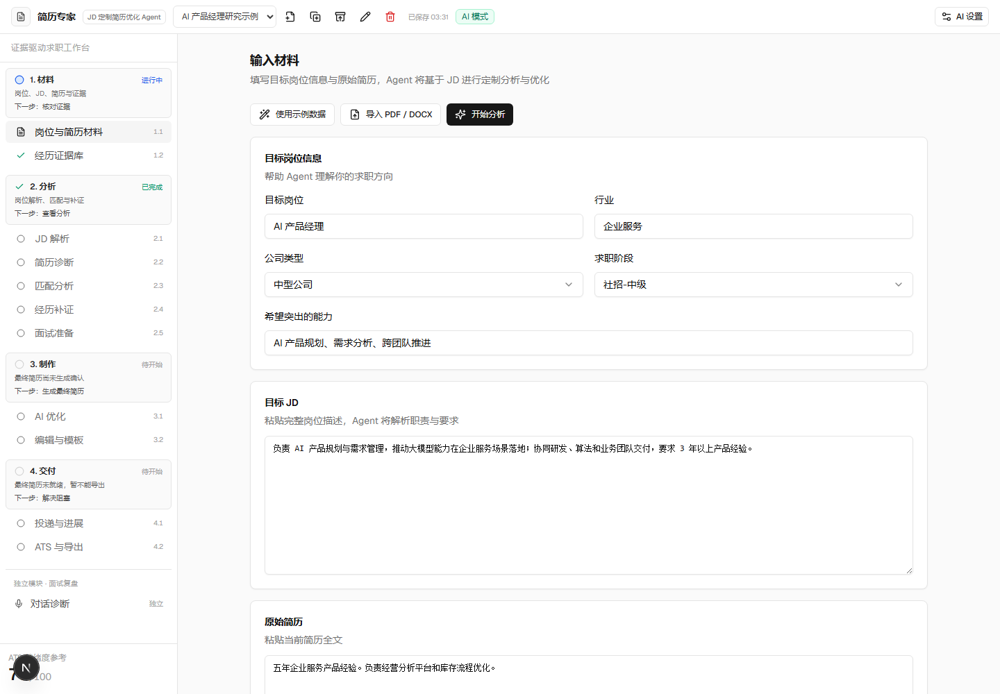
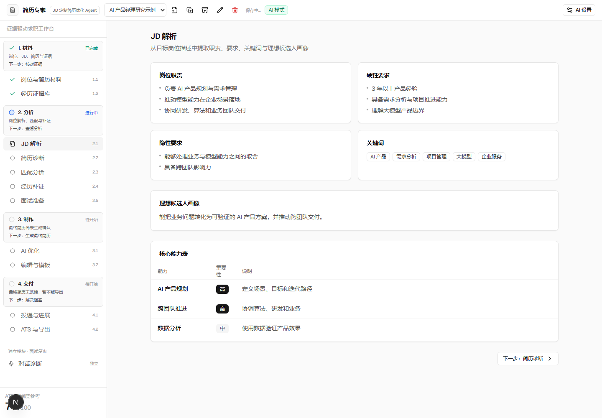
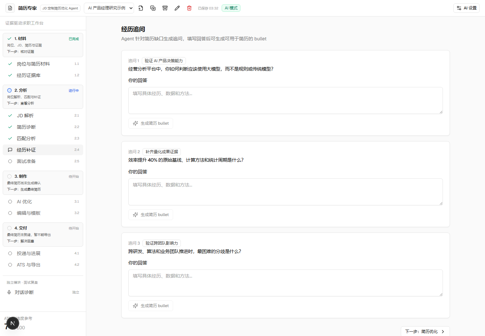
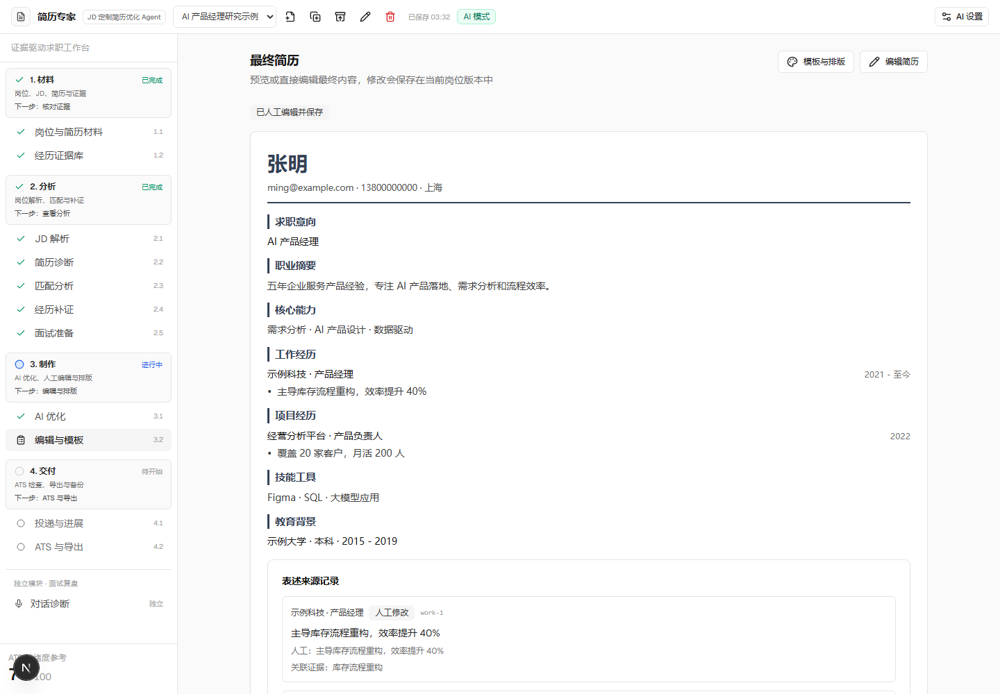
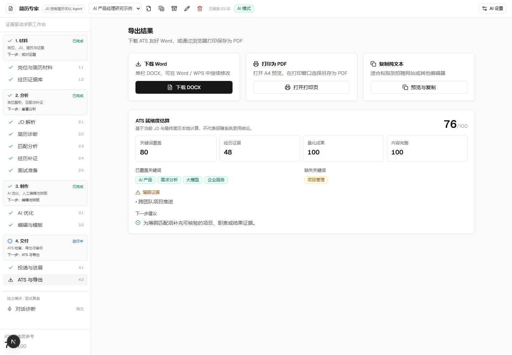
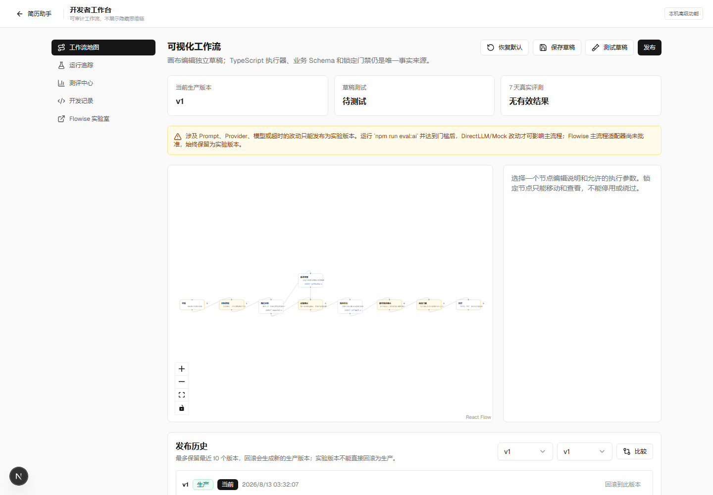

# 当前产品流程截图审计

> 审计日期：2026-08-13  
> 产品：resume-expert V1.7.2，本机 `http://127.0.0.1:3000/`  
> 浏览器：Playwright Chromium，1440 × 1000 视口  
> 数据：项目内新建的纯合成示例；使用全新浏览器上下文，不读取用户当前浏览器数据。

## 审计范围

用户目标是完成“材料 → 分析 → 补证 → 制作 → 交付”，并能在 Studio 理解和调整开发工作流。本次捕获六个代表状态，进行 UX、视觉层级和截图可观察范围内的无障碍风险审计。

## 总体判断

现有流程框架清楚、操作稳定、桌面端密度克制，四阶段和当前状态基本可理解。主要问题不是视觉粗糙，而是界面表达的“可信程度”超过底层数据真正能够证明的程度：页面展示了证据、完成状态和分数，却缺少事实来源、算法展开、推断标签和逐项用户决策。

下一步不建议先重做视觉主题。更值得投入的是重新设计信息结构和确认交互，让事实、推断、偏好、公开信号和 AI 候选在页面上明确分层。

## Step 1：输入材料 — 一般，入口清楚但目标上下文不足

健康度：**一般**。

### 优点

- “示例数据、导入、开始分析”三个主入口集中且容易发现。
- 目标岗位、JD 和原始简历按卡片分组，桌面端扫描顺序自然。
- 左侧四阶段、下一步与阻塞原因给出了流程导航。

### UX 风险

- “公司类型”默认显示为中型公司，用户未选择时也像已确认事实。
- 缺少目标公司、团队、业务线、规模、阶段、地点和工作方式。
- “希望突出的能力”混合了岗位要求、系统建议和用户偏好；当前字段还会污染 ATS 得分。
- “补充信息”位于首屏以下且没有回答方向、缺口提示或分类型入口。
- “Agent 将进行定制分析”过于宽泛，没有告诉用户哪些内容会发送给模型、哪些会保留本地、哪些结论需要确认。

### 无障碍风险

- 从截图无法验证键盘顺序、错误焦点和读屏状态；现有视觉标签与输入框关系清楚。
- 顶部多个只有图标的文档操作在截图中含义不明显，应核对可访问名称、tooltip 与触控目标大小。

### 建议

- 把岗位信息升级为 `JobTarget`；默认公司类型为“未选择”，增加自定义。
- 将能力拆为“JD 明确要求 / AI 推荐 / 用户希望突出”，每项显示来源和采用状态。
- 为补充信息增加“项目不会描述、数字不会计算、转行/空窗、作品/证书、公司信息、帮我检查缺口”等入口。

## Step 2：JD 解析 — 一般，摘要清楚但无法逐条行动

健康度：**一般**。

### 优点

- 职责、硬性要求、隐性要求和关键词分区明确。
- 核心能力表用重要性标签形成了基础层级。
- 页面简洁，没有用一整段模型文字淹没用户。

### UX 风险

- 没有左侧 JD 原文或原文锚点，用户无法确认某条结论从哪里来。
- “隐性要求”和“理想候选人画像”显示方式与明确要求相似，容易把模型推断当成招聘方事实。
- 没有逐条 Requirement ID、must/preferred、业务场景、期望产出、行业经验和证据标准。
- 页面只有统一“下一步”，不能针对某条要求查看项目匹配、补证、面试体现或反向提问。

### 无障碍风险

- 重要性主要依赖文字“高/中”，不是只靠颜色，这是优点。
- 表格在窄屏和放大场景的重排无法从截图确认；需进行 200% 缩放和键盘表格导航测试。

### 建议

- 使用“JD 原文高亮 + Requirement 卡片”双栏布局。
- 对推断统一显示“依据、置信度、替代解释、待验证问题”。
- 每条要求直接进入项目匹配、经历补证、面试训练和反向提问。

## Step 3：经历补证 — 较弱，问题可见但用户缺少帮助

健康度：**较弱**。

### 优点

- 每道题带有简短目的标签，用户能理解为什么被问。
- 问题按卡片隔开，填写空间充足。
- 在未回答时禁用生成按钮，避免明显空输入。

### UX 风险

- 用户如果完全不会回答，除了占位文字没有任何帮助。
- 没有显示该问题支持哪条 JD 要求、哪个项目和当前缺失证据。
- 所有问题一次铺开，问题数量像模型固定生成，而不是信息缺口驱动。
- “生成简历 bullet”跨过了原子事实确认；用户回答应先拆成事实和数字候选，再生成话术。
- 没有“回忆线索、回答框架、虚构示例、暂时不知道、换一个项目”操作。

### 无障碍风险

- 重复的“你的回答”和“生成简历 bullet”需要确保每个控件有唯一可访问名称，不能只依赖视觉邻近。
- 问题生成后的动态状态应使用 `aria-live`，截图无法确认。

### 建议

- 改成单题聚焦或分组访谈，并显示覆盖进度与停止原因。
- 三级帮助：回忆线索 → 回答框架 → 明确标为虚构的示例。
- 回答后先展示原子事实、数字和风险候选，逐项确认后再生成简历、面试和作品集话术。

## Step 4：最终制作 — 较好，但来源记录会造成虚假安全感

健康度：**较好**。

### 优点

- 简历预览是页面视觉主体，模板与编辑入口位置合理。
- “已人工编辑并保存”明确表达当前状态。
- 来源记录至少建立了“原始 / AI / 人工 / 证据”的透明化意图。

### UX 风险

- 当前“关联证据”由弱文本相似度自动建立，界面却没有显示候选、置信度或待复核状态。
- 人工修改实体、日期或数字后仍可能保留旧 evidence IDs，页面继续显示已关联。
- 来源记录在预览下方形成很长的第二份内容，缺少按风险、变更和未确认状态筛选。
- 教育只有单段学校/学位/时间，缺少专业、GPA、课程、荣誉、证书和继续教育。
- 当前优化建议不能逐条采用、拒绝和编辑，也看不到统一话术资产的版本链。

### 无障碍风险

- 简历正文的语义标题层级和打印阅读顺序需要 DOM/读屏验证，截图只能确认视觉层级。
- 小号浅灰元数据可能在低视力和高缩放下难以阅读，应做对比度与 200% 缩放检查。

### 建议

- 证据引用必须来自明确 claim ID；自动匹配只产生候选。
- 把来源记录改成“事实与风险检查器”，优先展示断链、冲突、数字无口径和已过期项。
- 编辑器支持多教育记录与条件显隐。

## Step 5：交付 — 较好，任务清楚但评分解释不足

健康度：**较好**。

### 优点

- DOCX、PDF 和复制文本三种交付方式清晰并列。
- 明确标注“ATS 就绪度估算”和“不代表招聘系统录用结论”。
- 总分、子分、关键词和建议在一个页面完成交付前检查。

### UX 风险

- 76 分看似精确，但页面没有展开 40/30/20/10 权重、每个子分的计算明细和证据来源。
- “量化成果 100”只因 bullet 含数字即可获得，容易奖励无口径数字。
- “经历证据 48”没有列出每条 Requirement 对应哪条事实、为什么是强/中/弱。
- 已命中关键词不区分事实支持、仅提及和否定语境。
- 建议只有一句，缺少可直接返回相关项目/事实进行修复的入口。

### 无障碍风险

- 绿色/黄色标签同时有文字，未只依赖颜色。
- 分数大字层级清楚；仍需核对读屏朗读顺序和打印按钮的新窗口提示。

### 建议

- 每个子分提供公式、输入、贡献项和限制说明。
- 独立展示证据链完整度，ATS 不负责评估事实真假。
- 每个缺口链接回 Requirement、项目或数字证据编辑器。

## Step 6：Studio — 一般，理念透明但默认画布难读

健康度：**一般**。

### 优点

- 明确说明 TypeScript 执行器、业务 Schema 和锁定门禁仍是事实来源。
- 草稿、测试、发布、回滚和真实评测门禁的信息可见。
- 业务界面和开发者工作台分离，不干扰普通用户。

### UX 风险

- 默认缩放下节点非常小，画布大部分为空白，用户难以阅读节点说明和连接。
- 右侧编辑区没有选择节点时占据较大空间，却没有工作流摘要、图例或帮助。
- “当前生产版本、草稿测试、7天真实评测”只显示状态，没有一眼可见的通过条件与下一动作。
- 当前 Studio 能调整技术参数，但尚不能透明展示“该业务步骤引用哪些领域对象、为什么被阻塞”。
- 用户要求的职业资产工作流还没有独立地图；现在画的是系统执行节点，不是完整用户价值流。

### 无障碍风险

- React Flow 的键盘节点选择、连线、缩放和读屏描述需要实际键盘/辅助技术测试。
- 小尺寸节点文字即使视觉正常，在高缩放或低视力场景仍不够友好。

### 建议

- 首次进入自动 fitView 到可读节点字号；提供概览/详情切换和图例。
- 在技术执行图外增加只读“职业资产价值流”，避免用户把两种工作流混为一谈。
- 节点详情显示输入对象、输出对象、依赖 revision、失败/阻塞原因和评测门槛。

## 优先级建议

### P0：可信状态而非视觉改版

- 旧分析失效、ATS 输入污染、Mock 假事实、证据断链、备份外键和恢复丢失。
- 事实、推断、偏好、公开信号和主观样本的视觉与数据分层。

### P1：职业资产交互

- 项目 CRUD 和分段访谈；
- 原子事实与数字逐项确认；
- 能力、熟练度和证据；
- Requirement 逐条分析、匹配和补证；
- 用户不会回答时的帮助阶梯。

### P2：训练、公司研究和 Studio 可读性

- 面试回答—评分—证据闭环；
- 有来源、有时效的公司研究；
- Studio 工作流默认缩放、业务对象和评测状态解释。

## 证据限制

- 截图只能支持可见的层级、信息、文案和布局判断；不能证明完整 WCAG 合规。
- 未在本次截图审计中验证手机布局、200%/400% 缩放、屏幕阅读器、全键盘操作、语音录制授权和真实打印弹窗。
- 使用合成状态直接进入代表页面，未以真实模型重新生成内容；这避免真实数据和模型随机性，但不覆盖加载等待、模型错误和多轮对话体验。
- 静态代码审计和现有 E2E 结果在其他报告中单独记录，不用来冒充截图证据。
