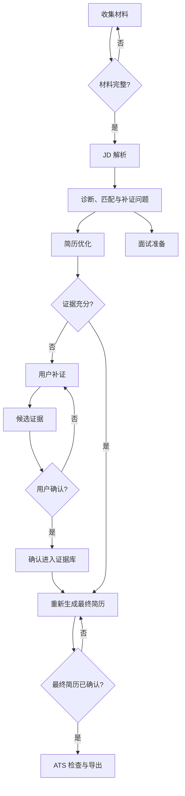
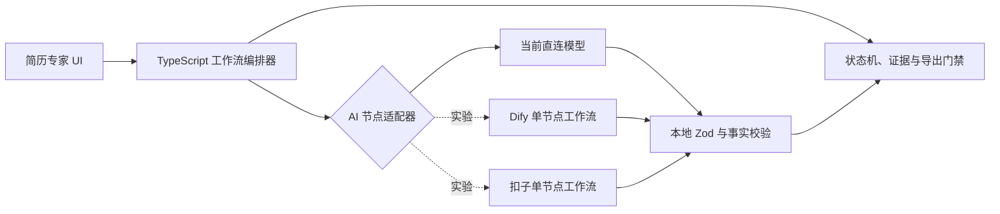

# 简历专家工作流平台选型竞品分析报告（快速版）

> 分析日期：2026-08-12
> 我方产品：简历专家 TypeScript 固定工作流
> 对比对象：扣子 / Coze Studio、Dify
> 聚焦维度：开发成本、可控性、隐私、事实可信度、测试和部署

## 一、结论

当前版本不应将核心工作流迁移到扣子或 Dify。简历专家的主要难点是本地业务状态、证据来源、人工确认、数据迁移、导出门禁和可重复测试，而不是缺少可视化节点编辑器。

推荐架构：TypeScript 继续作为唯一工作流事实来源；如需验证平台能力，仅将单个无状态 AI 节点接入 Dify 或扣子进行实验，并在应用本地继续执行 Zod 校验、证据校验和状态写入。

## 二、产品定位对比

| 维度 | TypeScript 固定工作流 | 扣子 / Coze Studio | Dify |
|---|---|---|---|
| 核心定位 | 为本产品定制的业务编排 | 可视化 Agent、应用和工作流开发平台 | AI 应用、工作流、RAG、模型与可观测平台 |
| 主要用户 | 本项目开发者 | 低代码用户、AI 应用开发者 | AI 应用开发者和团队 |
| 主要优势 | 强类型、精确状态、易测试、与产品同库 | 拖拽快、对话流和中断恢复、平台资源丰富 | 模型管理、工作流节点、RAG、自托管和可观测能力完整 |
| 主要成本 | 需要编写代码 | 平台依赖、发布版本、数据边界或自托管运维 | Docker 与中间件运维、平台升级和额外接口层 |

## 三、核心能力对比

| 能力 | TypeScript 固定工作流 | 扣子 / Coze Studio | Dify |
|---|---:|---:|---:|
| 可视化编排 | 弱 | 强 | 强 |
| 复杂业务状态精确控制 | 强 | 中 | 中 |
| 与 Zustand、本地存储和 UI 联动 | 强 | 弱 | 弱 |
| Zod 与 TypeScript 类型一致性 | 强 | 需额外适配 | 需额外适配 |
| 单元测试和 Playwright 回归 | 强 | 需要平台联调 | 需要平台联调 |
| 模型快速切换 | 中 | 强 | 强 |
| RAG / 知识库 | 当前较弱 | 强 | 强 |
| 执行日志和节点调试 | 中 | 强 | 强 |
| 本地个人隐私边界 | 强 | 云版较弱，自托管中 | 自托管强，云版取决于配置 |
| 零额外基础设施 | 强 | 云版强，自托管弱 | 弱 |

## 四、为什么现有系统属于 TypeScript 固定工作流

固定工作流是指流程图、分支条件、状态转换和失败处理由代码预先定义，而不是由大模型临时决定下一步。

当前主流程可抽象为：



其中大模型只负责若干节点内部的理解和生成；TypeScript 负责：

- 缺少材料时阻止分析。
- 决定 JD、诊断、优化和面试节点的先后与并行关系。
- 将修改后的最终简历标记为 `draft`、`confirmed` 或 `stale`。
- 控制候选证据必须经用户确认后才成为长期事实。
- 对模型输出执行 Zod 校验和一次自动修复。
- 阻止未确认或过期简历导出。
- 持久化岗位版本、迁移旧数据并处理损坏数据恢复。

这种架构的特点是确定、可追踪、可测试。它并不排斥 AI，而是限制 AI 只在需要语义推理的节点中工作。

## 五、扣子适用性

扣子和开源 Coze Studio 适合快速搭建 Agent、应用、工作流、插件和知识库。公开 API 支持执行已发布工作流、流式运行，以及带问题节点的中断和恢复；工作流执行还可返回节点调试页面。

对本项目有价值的用途：

- 快速画出“新手 Demo 梳理”对话原型。
- 试验问题节点与多轮补证体验。
- 在不改主项目代码时演示一条新的 AI 工作流。
- 用扣子罗盘类能力辅助观察和评测 Prompt。

不适合直接接管的部分：

- 浏览器本地多文档状态和连续 Schema 迁移。
- 证据库的候选、确认、来源关联与删除规则。
- 编辑草稿保护、模板排版和 DOCX/PDF 导出。
- 与现有 46 项单元测试和 18 项 E2E 保持同一行为。

云版还意味着简历、JD 和个人经历会经过平台处理；自托管 Coze Studio 则需要 Docker、至少约 2 核 4GB，并需要自行处理代码节点、注册、监听地址和 API 权限等安全面。

## 六、Dify 适用性

Dify 适合需要统一模型管理、可视化工作流、RAG、插件、运行日志和实验观测的团队。官方工作流提供用户输入、参数提取、IF/ELSE、迭代、文档提取、模板和输出等节点，也可以通过 API 嵌入业务系统。

对本项目有价值的用途：

- 快速比较多个模型或 Prompt。
- 建立独立的 AI 测评和运行日志环境。
- 未来需要职位知识库、行业知识库时验证 RAG。
- 非开发人员参与调整 Prompt 和节点参数。

当前不值得承担的成本：

- 自托管最低约 2 核 4GB，并依赖 Docker Compose 及数据库、缓存等服务。
- 主产品和 Dify 各维护一份输入输出协议，容易发生版本漂移。
- 工作流 DSL、平台配置和项目 Git 代码需要同步发布。
- Dify 使用带附加条件的许可证；如未来作为多租户平台或修改其前端品牌，需要提前审查许可条件。

## 七、推荐的混合架构



任何外部平台都只返回结构化候选结果，不允许直接修改 Zustand、证据库或最终简历。主应用始终执行本地校验并决定是否写入。

建议定义统一接口：

```ts
interface ResumeAIStageProvider {
  analyzeJD(input: UserInput): Promise<JDAnalysis>;
  diagnoseMatch(input: UserInput): Promise<DiagnosisMatchResult>;
  generateFollowUpBullet(input: FollowUpInput): Promise<EvidenceCandidate>;
  finalizeResume(input: FinalizeInput): Promise<FinalResumeCandidate>;
}
```

当前实现为 `DirectLLMProvider`。只有确实需要平台实验时，再增加 `DifyProvider` 或 `CozeProvider`，并通过开发配置切换。

## 八、行动建议

| 优先级 | 建议 | 依据 |
|---|---|---|
| P0 | 保留 TypeScript 为唯一核心工作流 | 当前关键能力是事实门禁、状态与本地数据，而非节点画布 |
| P0 | 先完成证据强关联和测评集 | 能直接提升简历可信度，并为任何平台/模型切换建立基线 |
| P1 | 如想学习平台，先用 Dify 复刻一个无状态节点 | Dify 自托管、模型与观测能力更贴近后续工程实验 |
| P1 | 用扣子快速制作“新手 Demo 梳理”对话原型 | 问题节点和工作流调试适合验证交互想法 |
| P2 | 仅在需要 RAG、多人调 Prompt 或集中观测时正式引入 Dify | 到该阶段平台收益才可能超过维护成本 |
| P2 | 不把排版、证据库、持久化和导出迁入平台 | 这些属于确定性产品业务，不应交给 AI 编排平台 |

## 九、最终建议

当前没有必要正式接入扣子或 Dify。

如果目的是“让工作流看起来更直观”，使用 Mermaid 或 React Flow 展示即可；如果目的是“快速验证新手补证对话”，可在扣子做一次独立原型；如果目的是“未来统一模型、RAG、日志和实验”，优先小范围试用 Dify。

正式产品应继续遵循：TypeScript 决定流程，AI 处理语义任务，用户确认事实，确定性规则负责安全门禁。

## 主要信息来源

- Coze Studio 官方 GitHub 与 Wiki：工作流、API、部署和架构说明。
- 扣子官网与隐私政策：产品定位、工作流生成和开发者数据说明。
- Dify 官方 GitHub、文档和许可证：工作流节点、自托管、API、模型与许可说明。
